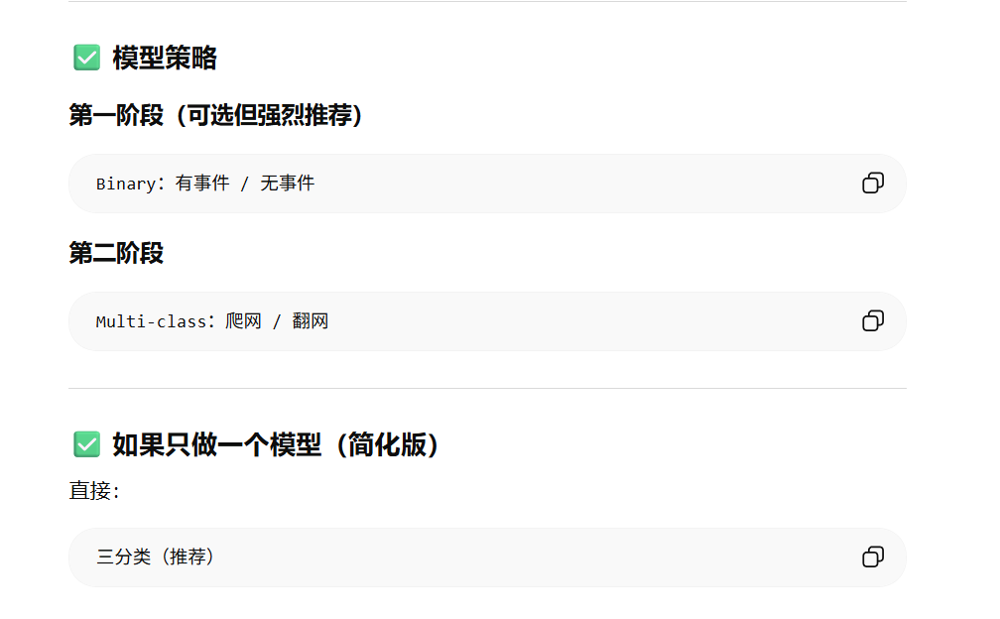

# 未来可能考虑的细节
- 数据增强：random，transform

# 整体思路
**如果现在标注很粗、空间位置不准、拓扑又复杂，先做“时间一维 + 多通道局部输入”的模型，往往比硬上二维更稳。
如果你能把光纤按物理路径展开成稳定的“距离轴”，并且能给出较可靠的事件位置，那二维模型上限更高。**

1D的缺点

- 会丢空间信息：事件可能在 70 通道附近传播到相邻通道，单通道会看不全。
- 对复杂事件不够鲁棒：像车辆、列车、多人活动、跨段事件，通常不是单点能完全描述的。

# 采集数据时注意
- 一定要采无事件数据，而且要采得足够多。
- 一定要采“硬负样本”，就是那些容易和事件混淆的正常片段，比如：
 -风吹
 -小动物
 -机械振动
 -设备背景噪声
 -其他非目标事件

# 基本思路

- 加mask，只保留70附近信息，注意3作为参数输入，**注意这里的mask在训练backbone的时候就要加入，免得浪费算力**
- 时频转换双分支
- 写项目文档，在doc中画流程图，用netron
- 训练和推理分两阶段，第一阶段识别有无事件，第二阶段区分事件类型
- 把周报整理成markdown放在diary里
- 使用 TensorBoard 对训练过程（loss、accuracy等）进行可视化监控，并验证模型权重文件的正确生成；
- 根据 NVIDIA T4 GPU 的显存约束，动态调整 batch_size；
- 引入 ReduceLROnPlateau 学习率调度策略，根据验证集表现自适应调整学习率，从而增强模型在复杂噪声环境下的收敛稳定性与泛化能力。 
