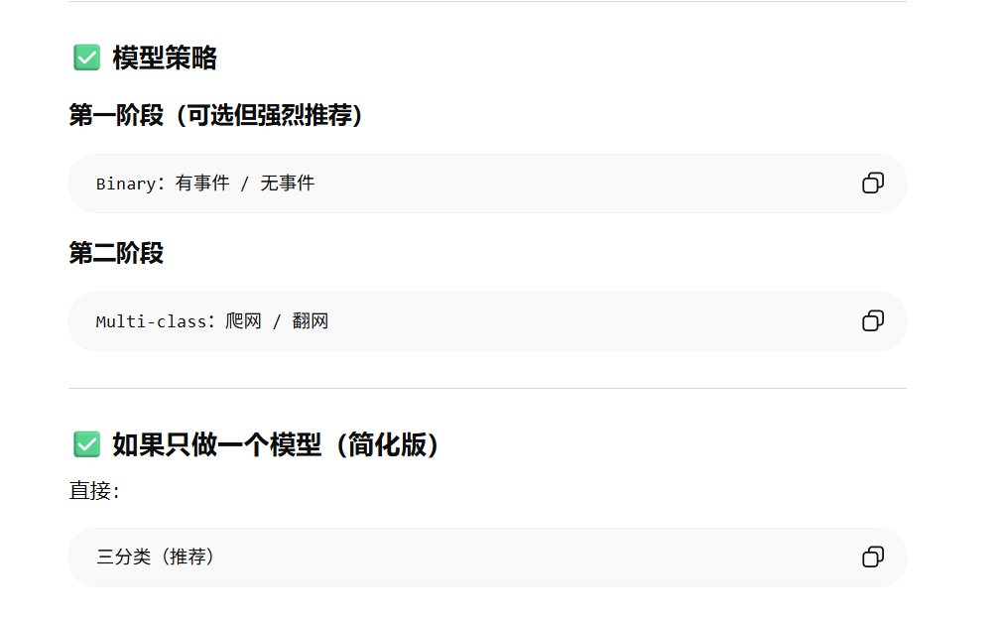

# 未来可能考虑的细节
- 数据增强：random，transform

# 整体思路
**如果现在标注很粗、空间位置不准、拓扑又复杂，先做“时间一维 + 多通道局部输入”的模型，往往比硬上二维更稳。
如果你能把光纤按物理路径展开成稳定的“距离轴”，并且能给出较可靠的事件位置，那二维模型上限更高。**

1D的缺点

- 会丢空间信息：事件可能在 70 通道附近传播到相邻通道，单通道会看不全。
- 对复杂事件不够鲁棒：像车辆、列车、多人活动、跨段事件，通常不是单点能完全描述的。

# 采集数据时注意
- 一定要采无事件数据，而且要采得足够多。
- 一定要采“硬负样本”，就是那些容易和事件混淆的正常片段，比如：
 -风吹
 -小动物
 -机械振动
 -设备背景噪声
 -其他非目标事件

# 基本思路

- 加mask，只保留70附近信息，注意3作为参数输入，**注意这里的mask在训练backbone的时候就要加入，免得浪费算力**
- 时频转换双分支
- 写项目文档，在doc中画流程图，用netron
- 训练和推理分两阶段，第一阶段识别有无事件，第二阶段区分事件类型
- 把周报整理成markdown放在diary里
- 使用 TensorBoard 对训练过程（loss、accuracy等）进行可视化监控，并验证模型权重文件的正确生成；
- 根据 NVIDIA T4 GPU 的显存约束，动态调整 batch_size；
- 引入 ReduceLROnPlateau 学习率调度策略，根据验证集表现自适应调整学习率，从而增强模型在复杂噪声环境下的收敛稳定性与泛化能力。 

- [x] 通道标号
- [x] 把class_emb用上，或其他方法，需要优化多分类的注意力机制头
- [x] https://chatgpt.com/share/69c66cd2-03a4-8322-9387-f8b86a75717b 注意能量这个地方还要改进
- [ ] 改成binary，因为多分类样本太少了
 
- ## 下周工作计划

### 一、DAS 异常检测任务

1. **类别不均衡问题优化**
   
   * 如图，由于当前 type 分类样本相对较少，损失函数反映出训练时存在明显类别不平衡问题；
   * 计划通过**调整 loss 权重（提升 loss_type 权重）**，优化模型对少数类别的识别能力；
   * 重点关注指标：**type-level F1-score 提升**。

2. **多类型注意力机制优化**

   * 针对不同事件类型在空间分布上的差异，引入**多头注意力机制（multi-head attention）**；
   * 每个事件类型对应独立 attention head，以增强模型的判别能力与可解释性。

3. **通道定位能力增强**

   * 将模型输出的**通道注意力权重**与**原始通道编号进行映射**；
   * 实现从“是否发生异常”向“异常发生位置（空间定位）”的能力扩展。

### 二、YOLO 目标检测任务

1. **数据标注质量检查**

   * 对现有数据集标注进行全面核查，确保标注准确性与一致性；

2. **模型精度提升**

   * 引入数据增强策略（如尺度变化、颜色扰动等），提升模型泛化能力；

3. **实时性与检测效果优化**

   * 优化检测框大小与回归策略，使检测结果更加贴合目标区域；
   * 在保证精度的前提下提升推理效率。

  

- 建一个大语言简单模型
- 用随机过程来估值，包括期权定价，股票估值，风险预估

### 一套完整傻瓜步骤

你可以直接按这个顺序做：

cd /home/sente/das_ai_project
chmod +x train.sh
tmux new -s das_train
bash train.sh

如果想退出 tmux 不关训练：

Ctrl + b
d

如果想回来继续看：

tmux attach -t das_train
